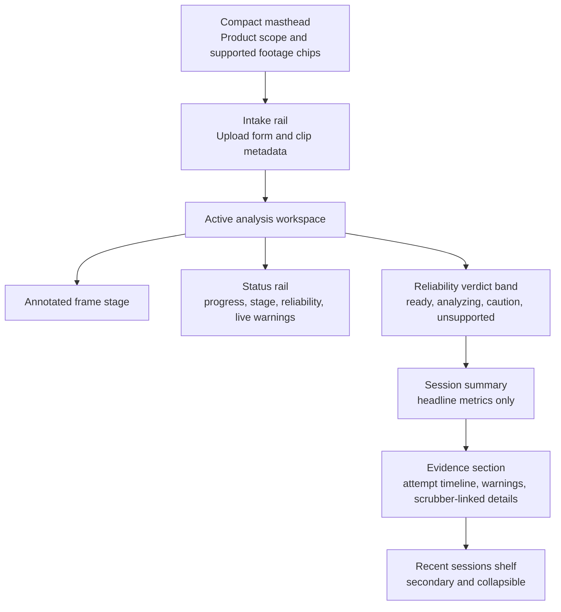

# UI Revamp Plan

## Objective

Rework OpenCrux from a polite landing page plus stacked panels into a focused climbing analysis workspace.

The redesign should make three things immediately legible:

- what footage OpenCrux supports
- whether the current run is trustworthy
- what evidence produced the reported metrics

This plan stays within the current product boundaries:

- local-first analysis
- single-climber bouldering or board footage
- deterministic, explainable outputs
- unsupported footage treated as a first-class product outcome
- no separate frontend toolchain unless the static UI clearly blocks product learning

## Current Problems

1. The page has no dominant task surface. The hero, upload form, history, live preview, and results all compete for attention.
2. Warnings are visible but not structurally primary, which weakens the product promise that unsupported or low-confidence footage should fail clearly.
3. Live analysis and final results feel like separate screens jammed onto one page instead of one continuous workflow.
4. The current visual hierarchy favors panels over decisions. Users see boxes, but not a clear reliability verdict.
5. History is too prominent for a product whose main loop is analyze one clip, inspect evidence, and decide whether to trust the result.

## Design Direction

OpenCrux should feel like a route card pinned beside an analysis bench, not a generic dashboard.

Recommended direction:

- sharp mineral surfaces instead of soft glass cards
- a dark basalt frame around the active analysis workspace
- chalk-white evidence cards on lighter surfaces
- safety orange reserved for warnings, unsupported states, and progress accents
- tighter masthead and stronger technical typography
- evidence-led layout where the annotated frame owns the page and metrics follow trust

This is a move away from the current warm editorial hero toward a more deliberate field-tool aesthetic.

## Visual System

### Design Principles

1. Verdict before metrics.
2. One active session at a time.
3. Evidence before explanation, explanation before history.
4. Unsupported is a product state, not an exception message.
5. Dense where it improves judgment, quiet where it does not.

### Typography

- Headline and UI family: a condensed or geometric grotesk such as Space Grotesk or Archivo SemiCondensed
- Body family: IBM Plex Sans or Source Sans 3
- Diagnostic labels and numeric metadata: IBM Plex Mono

Use type to separate product posture from analysis evidence:

- masthead and verdict language feel declarative
- metrics feel tabular and stable
- warning copy reads like operational guidance, not marketing copy

### Color Direction

Suggested starting tokens:

- Basalt: `#14171b`
- Chalk: `#f4f1ea`
- Dust: `#d8d1c4`
- Slate: `#28313a`
- Safety Orange: `#ff6a2a`
- Moss: `#68735b`
- Failure Red: `#b43a28`

Usage rules:

- Basalt owns the active workspace shell and key anchors.
- Chalk and dust carry cards and quiet surfaces.
- Orange appears only where attention is earned: progress, caution, unsupported conditions, and call-to-action emphasis.
- Green should be muted and used only for clearly supported runs.

### Motion

- Keep motion purposeful and sparse.
- Progress should feel like a sweep across the workspace, not a bouncing spinner.
- Section transitions should preserve layout continuity between live and completed states.
- Avoid decorative motion on history or metric cards.

## Target Information Architecture

### Desktop Layout

- A compact masthead sits above the fold and does not consume the full first screen.
- The upload rail stays near the top and remains visible as the start point of the workflow.
- The active analysis workspace becomes the dominant element.
- The annotated frame stage occupies the left side at larger scale.
- The right rail carries status, progress, reliability posture, and live warning summaries.
- A full-width verdict band sits directly beneath the workspace.
- Headline metrics come next, followed by attempt evidence and detailed warnings.
- History moves to the bottom shelf or a lighter side rail.

### Mobile Layout

Priority order:

1. Intake
2. Status and verdict
3. Frame stage
4. Headline metrics
5. Attempts and evidence
6. History

The mobile version should not preserve desktop panel adjacency if that hurts comprehension.

## Phase Plan

## Phase 1: Recompose The Existing App

Goal: improve hierarchy, trust signaling, and workflow continuity without changing the stack.

In scope:

- replace the oversized hero with a compact masthead
- reorganize the markup into a single active-session workspace
- create a verdict-first status model in the UI
- keep the same preview area across idle, live, completed, warning-heavy, and failed states
- reduce default on-screen diagnostics to the most decision-relevant fields
- demote history to a clearly secondary surface

Implementation boundaries:

- keep FastAPI-rendered HTML plus static CSS and vanilla JS
- keep polling-based live updates
- keep the 12-item recent history model
- do not introduce a separate frontend build system

## Phase 2: Improve Evidence Navigation

Goal: make the analysis easier to interrogate without increasing conceptual sprawl.

In scope:

- align attempt cards with scrubber positions and warning moments
- add clearer grouping for severity, attempt windows, and hesitation markers
- collapse low-signal diagnostics behind progressive disclosure
- refine copy so each warning communicates a user conclusion or next step
- improve history recall patterns for loading prior sessions into the same workspace

## Phase 3: Reassess Frontend Architecture

Only consider a richer frontend stack if the static app becomes the clear bottleneck.

Triggers:

- repeated render branching becomes hard to maintain
- timeline and evidence interactions become state-heavy
- side-by-side comparisons or multi-session workflows become necessary
- template duplication or DOM mutation logic starts obscuring product behavior

Preferred escalation path:

1. first tighten state modeling in the existing JS
2. only then consider a minimal frontend layer
3. avoid a full new toolchain unless complexity is clearly justified

## Phase 1 Acceptance Criteria

1. The main screen has one dominant active-session workspace above the fold on desktop.
2. Users can distinguish idle, analyzing, completed, caution, and unsupported or failed states within a few seconds.
3. High-severity warnings appear before metric cards and are visually stronger than informational notices.
4. The annotated frame area, progress, and scrubber remain in a stable location from live analysis through final results.
5. Headline metrics are reduced to the smallest useful set for fast judgment.
6. History remains available but is visibly secondary to the current session.
7. Mobile preserves the intended priority order without collapsing into a long sequence of equivalent cards.
8. The redesign ships without adding a separate frontend toolchain.

## Verification Plan

Validate the redesign against the existing milestone and manual verification workflow.

State coverage:

1. idle with no sessions
2. analysis actively running
3. completed cleanly on known-good footage
4. completed with heavy warnings on known-bad occlusion footage
5. unsupported or failed on known-unsupported footage

Checks:

- the verdict state is immediately visible in every state above
- unsupported footage does not read as a normal successful session
- warning-heavy runs do not visually imply confidence
- completed clean runs still feel compact and readable
- mobile preserves decision-making order rather than desktop symmetry

Source workflows:

- [README.md](README.md)
- [docs/milestone-1.md](milestone-1.md)
- [docs/manual-verification.md](manual-verification.md)

## Risks And Tradeoffs

### Static-UI-First Advantages

- lower implementation cost
- less architecture churn while the product slice is still narrow
- easier to keep the workflow explainable and deterministic

### Static-UI-First Risks

- UI state can become brittle as live, completed, and history flows become more connected
- richer evidence navigation may increase imperative DOM complexity
- visual reuse can drift without stronger component conventions

### Richer Frontend Stack Advantages

- better state modeling for live progress, history recall, and future comparisons
- easier reuse of structured UI primitives

### Richer Frontend Stack Risks

- higher maintenance and setup cost
- easy to over-invest in architecture before proving the product behavior
- conflicts with the current repo bias toward a thin, local-first first slice

## Open Questions

1. Should unsupported be a distinct verdict separate from failed, both visually and semantically?
2. Do backend warning severities need tighter normalization to support a consistent verdict band?
3. Is session comparison an actual near-term user need, or is fast single-session review enough for the next milestone?
4. Should history show warnings and failure posture directly in the list so risky sessions are obvious before loading them?

## Recommended Next Step

Phase 1 milestone execution is now defined in [ui-revamp-phase-1-handoff.md](ui-revamp-phase-1-handoff.md).

Write a phase 1 implementation plan against:

- [src/opencrux/templates/index.html](../src/opencrux/templates/index.html)
- [src/opencrux/static/app.css](../src/opencrux/static/app.css)
- [src/opencrux/static/app.js](../src/opencrux/static/app.js)

That implementation plan should preserve the current static architecture while specifying exact markup changes, CSS token updates, JS rendering changes, and manual verification steps for the five key UI states.